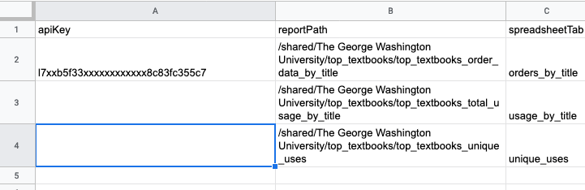

### Importing Alma Analytics Reports to Google Sheets ###

**Purpose**

This Google Apps script allows for calling the Alma Analytics API and retrieving one or more reports, data from which is then used to populate tabs in a given Google spreadsheet.

**Setup**

1. Clone the repo and/or download `analytics.js`.

2. Create or modify an existing Google Sheets document as follows:
   
   a. Create a tab called `config`.
   
   b. This sheet should have the following column headers:
     
     - apiKey
     
     - reportPath
     
     - spreadsheetTab

   c. Include your API key from the [Ex Libris Developer Network](https://developers.exlibrisgroup.com/) in the first row under the `apiKey` column.

   d. For each Alma Analytics report you wish to import, include the path to it in Analytics as a new row under the `reportPath` column. Each path must begin with the top-level folder. For example, a report saved in the IZ-shared folder for George Washington University, in a subfolder called `top_textbooks` would have this path: `/shared/The George Washington University/top_textbooks/top_textbooks_order_data_by_title`. The name of the report is the last part of the path.

   e. For each report, include the name of the tab in the current spreadsheet where you want the data to display as a new row under the `spreadsheetTab` column. (If the tab does not exist at import time, the script will create a new tab with that name. Any data in an existing tab will be overwritten.) Your `config` tab should look as follows: 

   

3. Now open the Script Editor under the Tools menu in Sheets, and create a new project (following the relevant instructions [here](https://developers.google.com/apps-script/guides/sheets)). 

4. Select `New` --> `Script` from the `File` menu, and paste in the code from `analytics.js`. 

5. Modify the line of code `var spreadsheet = SpreadsheetApp.openById('');` to include the ID string of your Google Sheet. (The ID is the long identifier described on [this page](https://developers.google.com/sheets/api/guides/concepts) of the Google Sheets API documentation.) Make sure your spreadsheet ID is between the single quotes in this line of code. Then save the code by clicking the floppy disk icon.

6. Now you should be able to run the script either by selecting the `main` function in the Script Editor console or by setting up a [project trigger](https://developers.google.com/apps-script/guides/triggers/).
